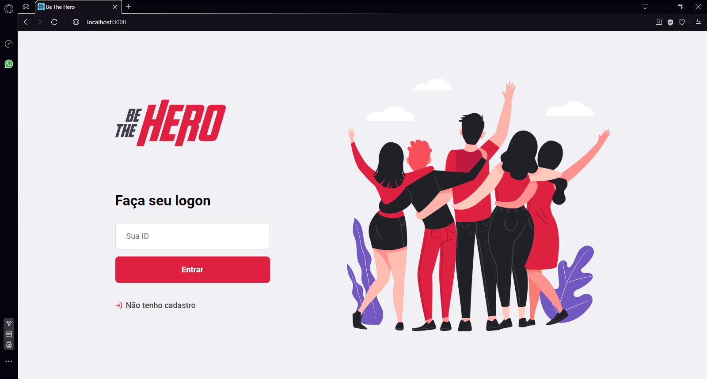
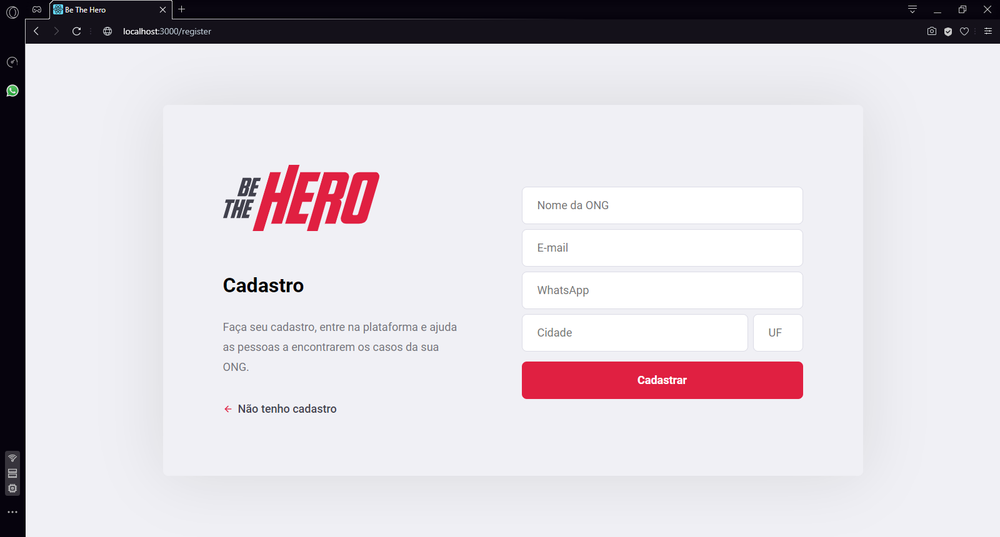
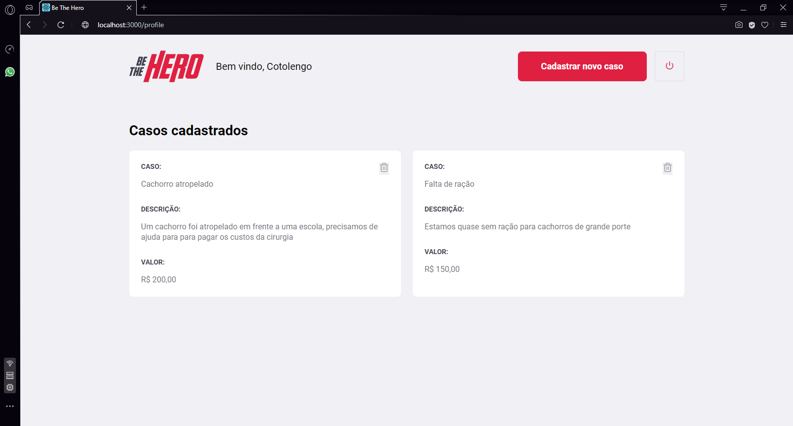
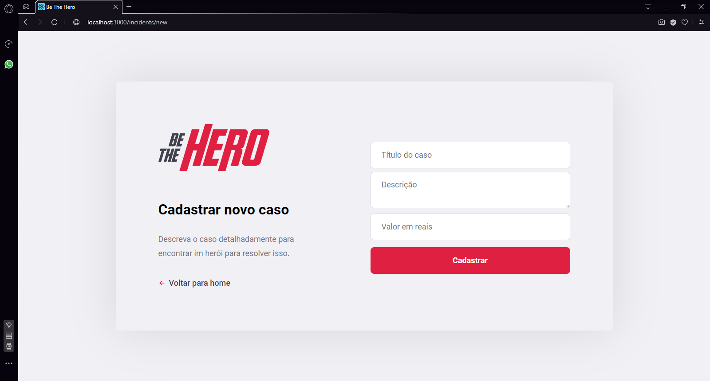

# Semana OmniStack 11.0

Aplicação Be The Hero

A Be The Hero é uma aplicação para conectar pessoas que tem vontade de ajudar, de forma monetária, ONGS que precisam de algum 
valor para tratar algum caso específio. 

Back-end desenvolvido com Node.js

Front-end desenvolvido com React.js

Mobile desenvolvido usando React Native e Expo

